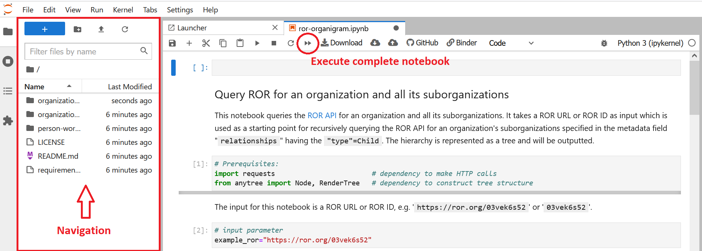

# pidgraph-notebooks

A collection of Jupyter notebooks with examples of querying different PID providers like [ORCID](https://orcid.org/), [ROR](https://ror.readme.io/), [Crossref](https://www.crossref.org/) and PID graphs like the [FREYA PID Graph](https://blog.datacite.org/powering-the-pid-graph/) and [OpenAlex](https://openalex.org/about) for connected objects. 

Currently included connections:
* organization-organization
  * input: ROR
  * output: hierarchy of sub-organizations starting at given organization, each identified by their ROR
  * data sources: ROR
* organization-people
  * input: ROR
  * output: list of people affiliated with the organization, each identified by their ORCID iD
  * data sources: FREYA PID Graph, OpenAlex, ORCID
* person-works
  * input: ORCID
  * output: list of works authored/created by the person, each identified by their DOI
  * data sources: Crossref, FREYA PID Graph, OpenAlex, ORCID
  

Please navigate into the respective folder to see the list of available notebooks. 

### Run notebooks
While GitHub renders Jupyter notebooks as static HTML files (not executable), 
you can use this link to launch the notebooks on Binder where you can execute and modify them:

----------------------------

### Background
In the joint project [TAPIR](https://projects.tib.eu/tapir/en/) (Partially Automated Persistent Identifier-based Reporting), partially automated procedures for research reporting are being tested in the context of university and non-university research. To this end, the question is being investigated : 

To what extent can the necessary data aggregation be carried out on the basis of openly available research information using persistent identifiers?
